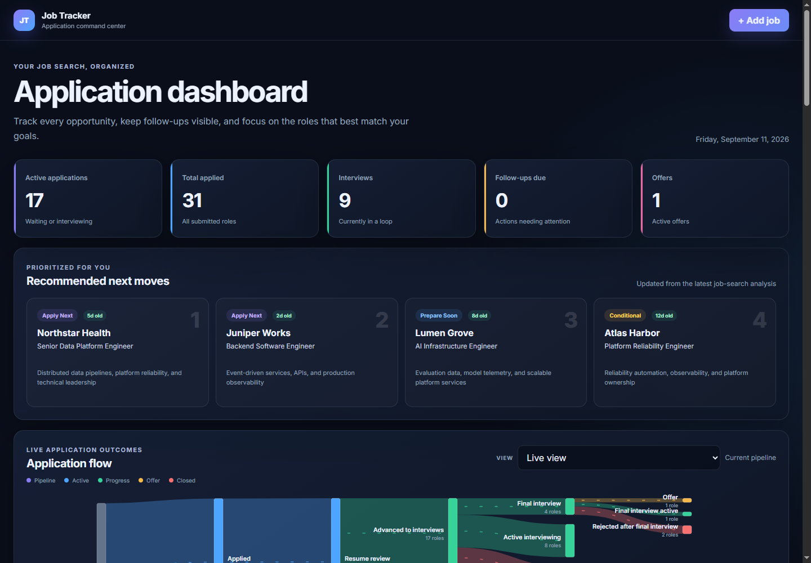

<div align="center">

# 🚀 Job Search Copilot

### Your private, agent-powered job-search command center

[](https://github.com/diegoruv20/job-search-copilot/actions/workflows/validate.yml)
[](LICENSE)
[](https://www.python.org/)
[](docs/data-and-privacy.md)

**Find better roles. Build truthful applications. Prepare with evidence.**

**Keep your personal data on your own computer.**

Job Search Copilot gives your preferred coding agent a guided career strategy,
application, interview, and customizable local-tracker workflow. GitHub Copilot
CLI is fully configured out of the box, while the core works with any MCP-capable
agent.



<sub>✨ Example dashboard using only the repository's fictional demonstration data.</sub>

</div>

## ✨ More than an application spreadsheet

This workspace helps you understand what you have actually accomplished, discover
roles that fit that evidence, and move each opportunity forward without losing
the details that matter.

| | Capability | What it does |
|---|---|---|
| 🧭 | **Guided career discovery** | Interviews you in short rounds, builds an evidence inventory, and identifies realistic role families and positioning |
| 🔎 | **Verified job search** | Uses Playwright to inspect human-visible job sites and official postings before recording opportunities |
| 📊 | **Private application tracker** | Tracks jobs, follow-ups, outcomes, freshness, conversion, and application-flow history in local SQLite |
| 📝 | **Application strategy** | Creates evidence-based resumes, application answers, company notes, and outreach drafts without submitting or sending |
| 🎯 | **Interview coaching** | Builds role-specific plans and runs realistic, scored practice using your confirmed experience |
| 🛠️ | **Safe customization** | Lets an agent redesign workflows and add features while protecting local data and existing behavior |

### See the application funnel move

[▶ **Watch the Sankey timeline build from an empty tracker to an offer (MP4, 18 seconds)**](docs/media/application-flow-demo.mp4)

The fictional playback adds tracked opportunities, records Not-a-Fit decisions,
submits applications, and follows candidates through resume review, interviews,
final decisions, rejections, withdrawal, and an offer.

### The important difference

- **Evidence first:** it separates direct experience, transferable evidence,
  genuine gaps, and unknowns instead of inventing qualifications.
- **Human controlled:** it can prepare applications and messages, but it stops
  before submitting, uploading, or contacting anyone.
- **Built to evolve:** each user can customize the product while broadly useful
  improvements flow back through reviewed pull requests.

## ⚡ Go from clone to dashboard

> **Current setup target:** Windows, Python 3.10+, Node.js LTS with `npx`, and an
> MCP-capable coding agent. GitHub Copilot CLI is the preconfigured default.

### 1. Clone and set up

```powershell
git clone https://github.com/diegoruv20/job-search-copilot.git
cd job-search-copilot
.\scripts\setup.ps1
```

The guided setup creates `.venv`, installs dependencies, initializes a blank
SQLite tracker, creates private profile templates, runs tests, and checks MCP
readiness. Existing profiles and tracker data are never overwritten.

### 2. Choose your agent

For GitHub Copilot CLI, run `copilot` from the repository, trust the folder, and
open `/mcp`. You should see:

- `job-search-copilot` — manages your local tracker
- `playwright` — researches job sites and checks the dashboard

For another MCP-capable agent, follow [Use your preferred agent](docs/agents.md)
and copy the portable Windows or POSIX server definitions into that client's
project configuration.

### 3. Let it learn your real experience

Skip the giant questionnaire. Start a short, guided interview:

> Use the career-discovery agent. Interview me to build my job-search profile and
> experience inventory. Ask three to five simple questions at a time, update the
> files after each round, and help me identify realistic role families and
> positioning.

Your agent maps your systems, projects, personal ownership, metrics, preferences,
constraints, and transferable experience before recommending roles.

### 4. Open your command center

Ask:

> Start my dashboard and show my highest-priority next actions.

Or launch it directly:

```powershell
.\.venv\Scripts\python.exe app.py
```

Then visit [http://127.0.0.1:5050](http://127.0.0.1:5050).

## 💬 Things you can ask

| Goal | Example prompt |
|---|---|
| 🔎 **Find roles** | `Find newly published backend and data-platform roles that fit my profile. Verify official postings and add only strong candidates.` |
| 📝 **Prepare an application** | `Prepare the application package for job 12, but do not submit anything.` |
| 🤝 **Draft outreach** | `Research the best warm contact for job 12 and draft a message for me to send manually.` |
| 🎤 **Practice an interview** | `Run a 45-minute cold system-design mock for my next confirmed stage.` |
| ✅ **Record progress** | `I applied today using the final resume. Update the tracker and set the next follow-up.` |
| 🛠️ **Customize the product** | `Use the product-customizer agent to add a weekly planning view without breaking my current data or workflow.` |

## 🔒 Your data stays yours

Personal state is stored locally and excluded from Git:

| Local path | What lives there |
|---|---|
| `instance\` | SQLite application database |
| `local\` | Profile, experience inventory, and application artifacts |
| `backups\` | Online SQLite backups |
| `exports\` | Portable JSON exports |
| `runtime\` | Dashboard logs and process state |

The dashboard and tracker MCP run on your computer. Playwright accesses external
sites only when you request job research or browser verification.

**Job Search Copilot never submits applications, uploads documents, or sends
outreach without explicit approval.**

## 🧰 Useful commands

```powershell
# Check setup and profile readiness
.\.venv\Scripts\python.exe tracker_cli.py doctor

# Explore the dashboard with fictional jobs
.\.venv\Scripts\python.exe tracker_cli.py demo

# Protect or move your local data
.\.venv\Scripts\python.exe tracker_cli.py backup
.\.venv\Scripts\python.exe tracker_cli.py export

# Validate a development change
.\.venv\Scripts\python.exe scripts\release_check.py
```

Import and restore operations validate their source and require deliberate
replacement flags. Restore creates a safety backup before changing the database.

## 🧠 How it works

```text
Coding agent --> tracker MCP ----\
                                  > services.py --> SQLAlchemy --> local SQLite
Dashboard -----> Flask REST -----/
Playwright ----> job sites and dashboard
```

`services.py` owns the business rules. The browser REST API and MCP server are
thin adapters over the same validated lifecycle, keeping interactive and agent
workflows consistent.

## 🌱 Make it your own—and share the good parts

The repository is designed to become a custom solution for each user.

- A **universal fix** corrects behavior for everyone.
- A **shared feature** generalizes a useful idea through configurable, opt-in, or
  default-neutral behavior.
- A **personal customization** contains one person's data, preferences, paths, or
  one-off workflow and stays local or in a fork.

Agents and contributors use feature branches, the privacy-focused pull-request
template, GitHub review, and the full release gate. `main` is protected from
direct pushes, force-pushes, and unvalidated changes.

Read [CONTRIBUTING.md](CONTRIBUTING.md) before proposing a fix or feature.

## 📚 Explore the docs

- [🧭 Guided profile onboarding](docs/profile-onboarding.md)
- [🛠️ Safe customization](docs/customization.md)
- [🤝 Contributing fixes and shared features](CONTRIBUTING.md)
- [🤖 Agent setup and MCP configuration](docs/agents.md)
- [🧩 Portable workflows](docs/workflows.md)
- [🏗️ Architecture](docs/architecture.md)
- [🔐 Data ownership and recovery](docs/data-and-privacy.md)
- [🩺 Troubleshooting](docs/troubleshooting.md)
- [🛡️ Security and privacy](SECURITY.md)

## 📄 License

Job Search Copilot is available under the [MIT License](LICENSE). Fork it, adapt
the local workflows, and make it yours—just keep personal tracker data outside
Git.

## 🐧 macOS and Linux

GitHub Copilot CLI's committed MCP configuration currently targets Windows.
Other clients and operating systems can use the portable examples in
`config/mcp.windows.json` and `config/mcp.posix.json`.
